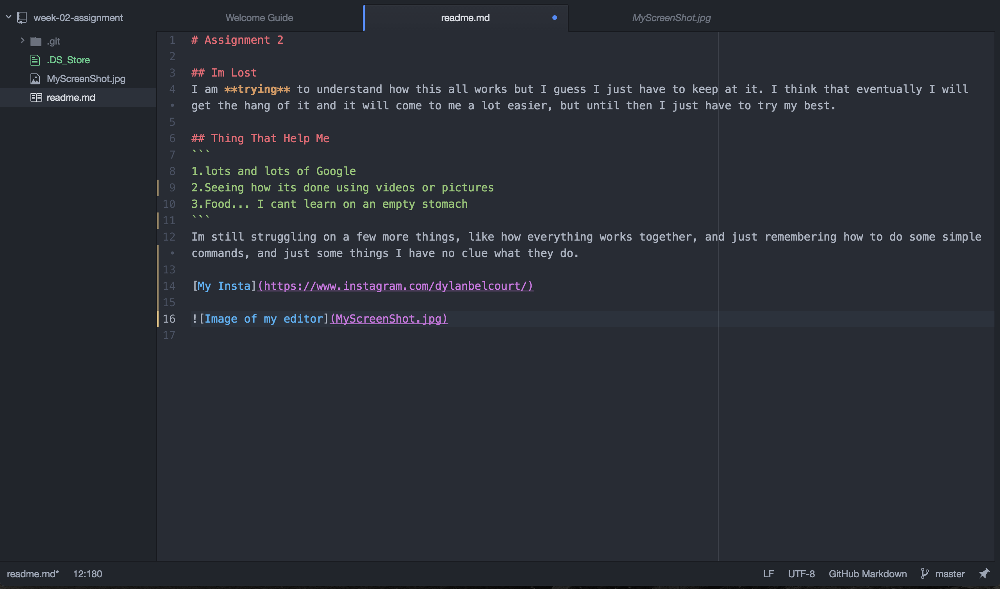

# Assignment 2

## Im Lost
I am **trying** to understand how this all works but I guess I just have to keep at it. I think that eventually I will get the hang of it and it will come to me a lot easier, but until then I just have to try my best.

## Thing That Help Me
```
1.lots and lots of Google
2.Seeing how its done using videos or pictures
3.Food... I cant learn on an empty stomach
```
Im still struggling on a few more things, like how everything works together, and just remembering how to do some simple commands, and just some things I have no clue what they do.

[My Insta](https://www.instagram.com/dylanbelcourt/)


